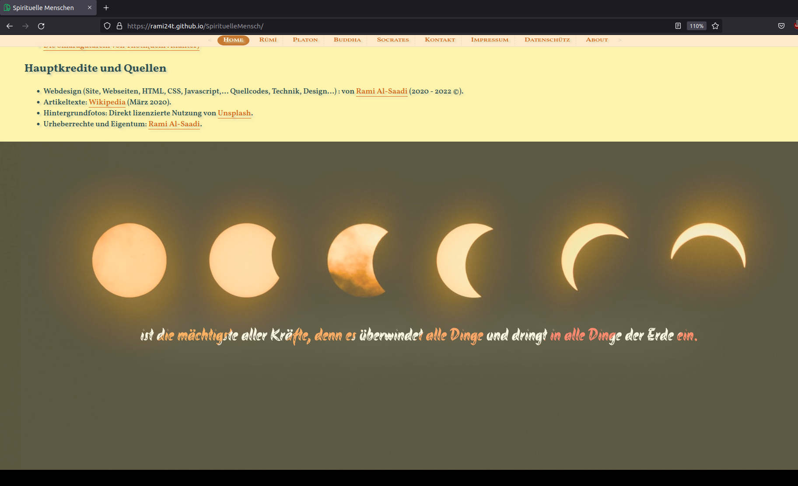

# SpirituelleMensch

CSS3/HTML5/Javascript Webseite Projekt (Eine Website über 4 spirituelle Menschen.)

A website that I designed and coded using HTML5, CSS3, and Javascript.
The text content in the website is mostly from Wikipedia.

Live: https://rami24t.github.io/SpirituelleMensch/

# Snapshots:

